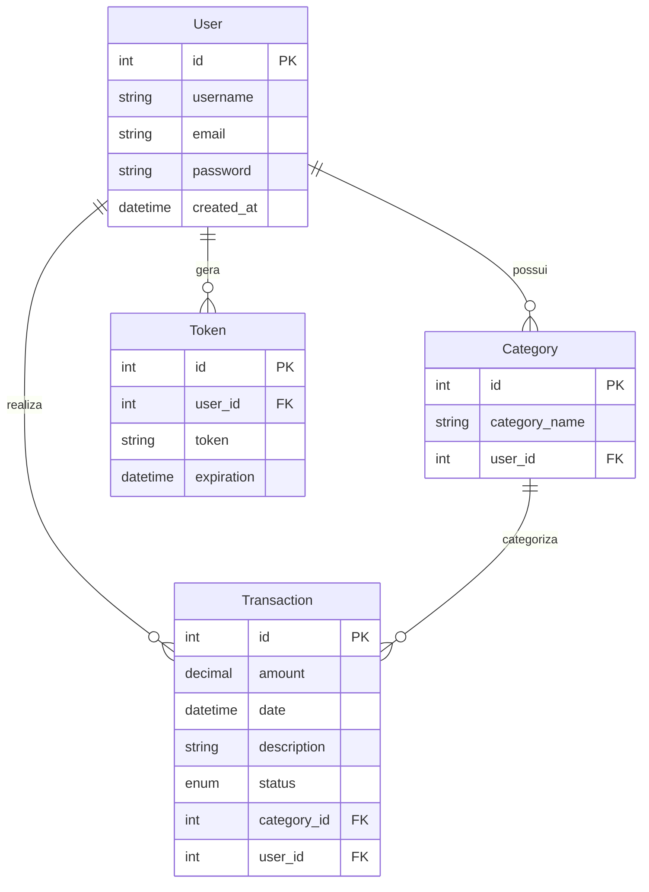

<div align="center">
  
  
  
  ### **Gerenciador de Finanças Pessoais com IA**

  [](https://www.oracle.com/java/)
  [](https://spring.io/projects/spring-boot)
  [](https://www.mysql.com/)
  [](https://ollama.com/)
  
  
  [](LICENSE)

  > **Projeto Integrador — 2º Semestre**  
  > *FATEC Cotia — Desenvolvimento de Software Multiplataforma*

</div>

---

## ✨ Sobre o Projeto

O **Yvest** é uma API REST desenvolvida como projeto integrador do segundo semestre da FATEC Cotia. A aplicação oferece um sistema completo de gerenciamento financeiro pessoal, combinando **controle de transações e categorias** com um **assistente financeiro inteligente** baseado em IA local.

### 🎯 Diferenciais

- 🔐 **Autenticação segura** com tokens de sessão
- 📊 **Controle financeiro completo** (receitas/despesas)
- 🤖 **Assistente financeiro com IA** utilizando Ollama + phi3:mini
- 💡 **Análises personalizadas** baseadas nos dados reais do usuário
- ⚡ **Cache inteligente** para otimizar respostas da IA
- 🎨 **API RESTful** com endpoints bem estruturados

---

## 🏗️ Arquitetura do Sistema

```mermaid
graph LR
    A[Cliente] --> B[API Spring Boot]
    B --> C[(MySQL)]
    B --> D[Ollama + phi3:mini]
    D --> E[Cache de Respostas]
    C --> F[Usuários]
    C --> G[Categorias]
    C --> H[Transações]
    style B fill:#6DB33F,stroke:#333,stroke-width:2px
    style D fill:#000000,stroke:#333,stroke-width:2px
```



### 📊 Modelo de Dados



---

## 🔌 Endpoints da API

### 🔐 Autenticação `/auth`

```http
POST   /auth/signup      # Cadastro de usuário
POST   /auth/signin      # Login → retorna token (1h)
POST   /auth/signout     # Logout → invalida token
GET    /auth/validate    # Validação de token
```

### 🏷️ Categorias `/categories`

```http
GET    /categories       # Lista categorias do usuário
POST   /categories       # Cria nova categoria
PUT    /categories/{id}  # Atualiza categoria
DELETE /categories/{id}  # Remove categoria
```

### 💸 Transações `/transactions`

```http
GET    /transactions                    # Lista todas
GET    /transactions/{id}               # Busca por ID
GET    /transactions/status/{status}    # Filtra por status
GET    /transactions/category/{id}      # Filtra por categoria
GET    /transactions/range?start=&end=  # Filtra por data
GET    /transactions/balance            # Saldo atual
POST   /transactions                    # Nova transação
PUT    /transactions/{id}               # Atualiza
DELETE /transactions/{id}               # Remove
```

### 🤖 Assistente IA `/chat`

```http
POST   /chat/ask         # Pergunta financeira
GET    /chat/analysis    # Análise financeira completa
GET    /chat/tips        # Dicas personalizadas
GET    /chat/investment  # Conselhos de investimento
GET    /chat/status      # Status do Ollama
DELETE /chat/cache       # Limpa cache
```

---

## 🚀 Tecnologias Utilizadas

<div align="center">

| Camada | Tecnologia | Finalidade |
|--------|------------|------------|
| **Linguagem** | Java 17+ | Base da aplicação |
| **Framework** | Spring Boot 3.x | API REST e injeção de dependências |
| **Persistência** | Spring Data JPA | ORM e queries |
| **Banco de Dados** | MySQL 8.x | Armazenamento relacional |
| **Segurança** | BCrypt + Tokens | Criptografia e autenticação |
| **IA** | Ollama + phi3:mini | Assistente financeiro local |
| **Build** | Maven | Gerenciamento de dependências |

</div>

---

## 📁 Estrutura do Projeto

```
yvest/
├── src/
│   └── main/
│       ├── java/
│       │   └── com/fateccotia/yvest/
│       │       ├── YvestApplication.java
│       │       ├── controller/         # Endpoints REST
│       │       │   ├── AuthController.java
│       │       │   ├── CategoryController.java
│       │       │   ├── TransactionController.java
│       │       │   └── ChatController.java
│       │       ├── service/            # Regras de negócio
│       │       │   ├── AuthService.java
│       │       │   ├── CategoryService.java
│       │       │   ├── TransactionService.java
│       │       │   └── FinanceChatService.java
│       │       ├── repository/         # Acesso a dados
│       │       │   ├── UserRepository.java
│       │       │   ├── CategoryRepository.java
│       │       │   ├── TransactionRepository.java
│       │       │   └── TokenRepository.java
│       │       ├── entity/             # Entidades JPA
│       │       │   ├── User.java
│       │       │   ├── Category.java
│       │       │   ├── Transaction.java
│       │       │   └── Token.java
│       │       └── enums/              # Enumeradores
│       │           └── TransactionStatus.java
│       └── resources/
│           └── application.properties  # Configurações
└── pom.xml                             # Dependências
```

---

## ⚙️ Como Executar

### Pré-requisitos

```bash
# Verificar instalações necessárias
java --version          # Java 17+
mysql --version         # MySQL 8+
ollama --version        # Ollama instalado
```

### Passo a Passo

```bash
# 1. Clone o repositório
git clone https://github.com/seu-usuario/yvest.git
cd yvest

# 2. Configure o banco de dados
# Edite src/main/resources/application.properties:
# spring.datasource.url=jdbc:mysql://localhost:3306/yvest
# spring.datasource.username=seu_usuario
# spring.datasource.password=sua_senha

# 3. Baixe o modelo de IA
ollama pull phi3:mini

# 4. Execute a aplicação
./mvnw spring-boot:run    # Linux/Mac
mvnw.cmd spring-boot:run  # Windows
```

A API estará disponível em: `http://localhost:8080`

---

## 🎓 Contexto Acadêmico

| | |
|---|---|
| **Instituição** | FATEC Cotia |
| **Curso** | Desenvolvimento de Software Multiplataforma (DSM) |
| **Disciplina** | Projeto Integrador |
| **Semestre** | 2º Semestre |
| **Período** | 2025 |

### Objetivos de Aprendizagem

- Aplicar conceitos de **API RESTful** com Spring Boot
- Implementar **autenticação segura** e controle de sessão
- Desenvolver **integração com IA local** (Ollama)
- Utilizar **boas práticas** de versionamento com Git
- Documentar **arquitetura e endpoints** de forma profissional

---

## 📈 Próximos Passos

- [ ] Implementar testes unitários e de integração
- [ ] Adicionar documentação Swagger/OpenAPI
- [ ] Implementar relatórios financeiros (PDF/Excel)
- [ ] Melhorar prompts e contexto do assistente IA

---

## 👥 Equipe de Desenvolvimento

| Nome | Função |
|------|--------|
| [Ana Clara MAdeira de Gois] | Documentação e Teste |
| [Jennifer Gabriely Lopes dos Santos] | Desenvolvedor Front-end |
| [Martie Bello Silva] | Documentação e Teste |
| [Maysa Alexandre Nazario] | Desenvolvedor Back-end |
| [Victória Heloísa de Melo Teixeira] | Desenvolvedor Front-end |

---

<div align="center">
  <br>
  
  
  <i>Projeto Integrador — 2º Semestre de DSM</i>
</div>
